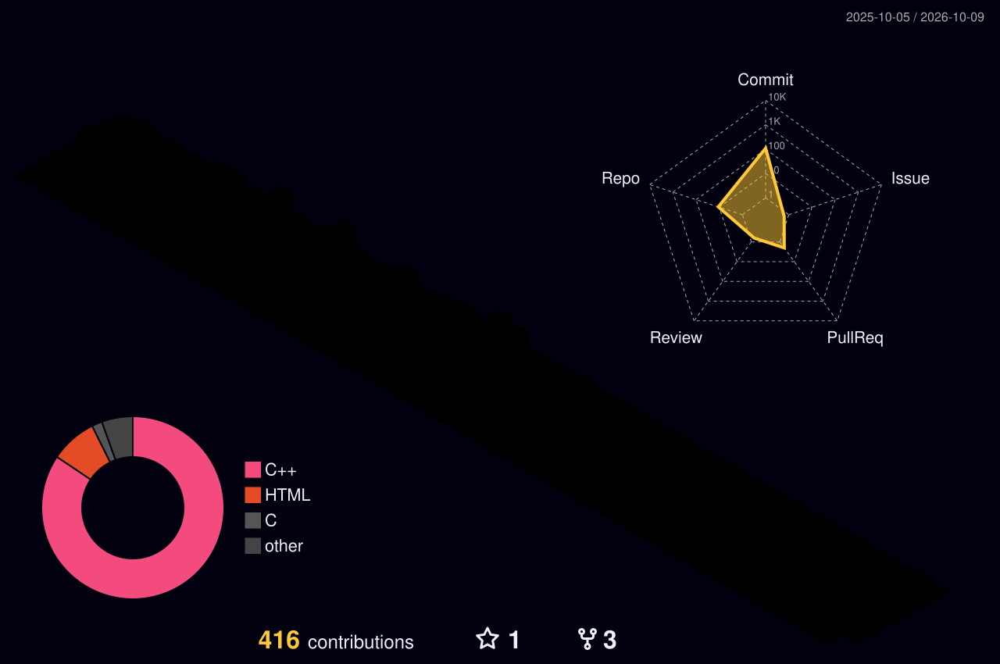

# Hi there, I'm Max 👋
I am a Robotics PhD Candidate at Georgia Tech. I am co-advised by Ye Zhao ([LIDAR Lab](https://lab-idar.gatech.edu/)) and Patricio Vela ([IVALab](https://ivalab.gatech.edu/)).

## Featured projects
- [DynamicGap](https://github.com/ivaROS/DynamicGap): Egocentric navigation planner designed for dynamic environments (ICRA `25)
- [QuadGap](https://github.com/ivaROS/quad_gap): Safe gap-based local planner for quadrupeds (ICRA `23) 
- [QuadPiPS](https://github.com/quad-pips-open/quad_pips): Search+optimization foothold planner for quadrupeds (current)

## Contributions

<!--
**max-assel/max-assel** is a ✨ _special_ ✨ repository because its `README.md` (this file) appears on your GitHub profile.

Here are some ideas to get you started:

- 🔭 I’m currently working on ...
- 🌱 I’m currently learning ...
- 👯 I’m looking to collaborate on ...
- 🤔 I’m looking for help with ...
- 💬 Ask me about ...
- 📫 How to reach me: ...
- 😄 Pronouns: ...
- ⚡ Fun fact: ...
-->
